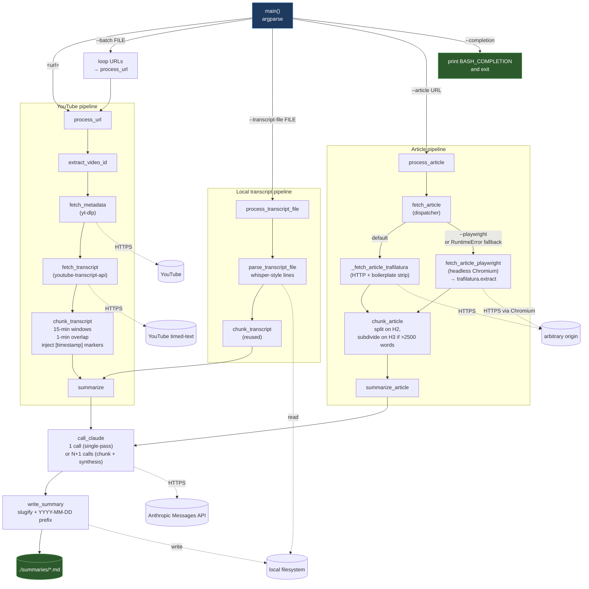

# Execution flow: `summarize.py`

Top-down view of how a single invocation flows through the script,
including the libraries it uses and the external systems it talks to.

## Libraries & external systems

| Stage | Library | External system |
| --- | --- | --- |
| Video metadata | `yt-dlp` | YouTube (HTTPS) |
| Video transcript | `youtube-transcript-api` | YouTube timed-text API |
| Article fetch (cheap path) | `trafilatura` (`fetch_url` + `extract`) | Arbitrary HTTP origin |
| Article fetch (fallback) | `playwright` (sync, headless Chromium) + `trafilatura.extract` | Same origin, JS-rendered |
| Local transcript | stdlib `re` + `pathlib` | Local filesystem |
| LLM calls | `anthropic.Anthropic` | Anthropic Messages API |
| CLI | stdlib `argparse` | — |
| Output | stdlib `pathlib` | Local filesystem (`./summaries/`) |

## Key shape

- **Four CLI dispatch branches** in `main()` route to one of three pipelines
  (plus the trivial `--completion` exit).
- **Each pipeline converges on a shared tail**: `summarize*` →
  `call_claude` → `write_summary`. The output format and slugified filename
  are identical regardless of source.
- **`call_claude` is the single chokepoint** to the Anthropic API. The
  `Anthropic` client is constructed once in `main()` with
  `max_retries=API_MAX_RETRIES`, so retry behavior and connection reuse are
  consistent across every LLM call (chunk, synthesis, single-pass, article
  variants).
- **`fetch_article` is try-cheap-then-fall-back**: trafilatura's plain HTTP
  first, Playwright/Chromium only if a `RuntimeError` bubbles. Both paths
  hand HTML to the same `trafilatura.extract()` call, so the meta dict and
  Markdown shape are identical downstream — variance at the edges,
  uniformity in the middle.
